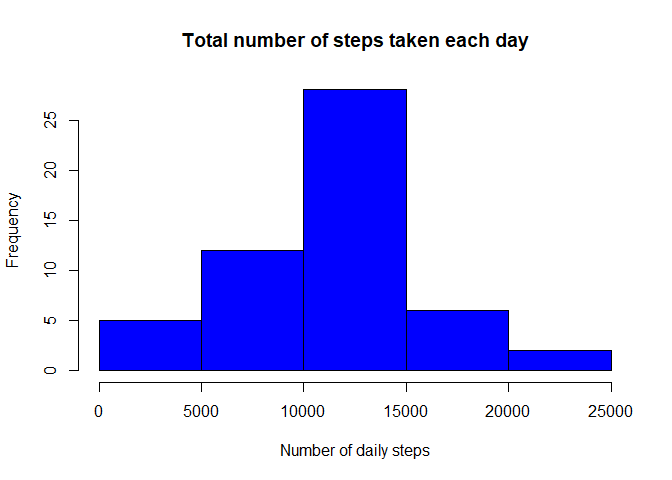
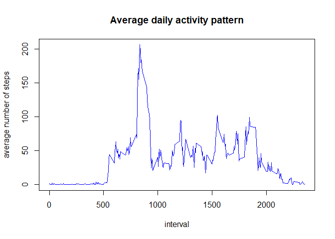
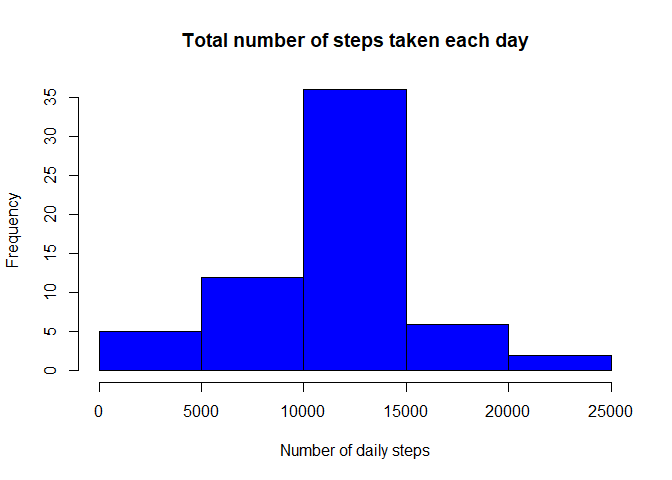
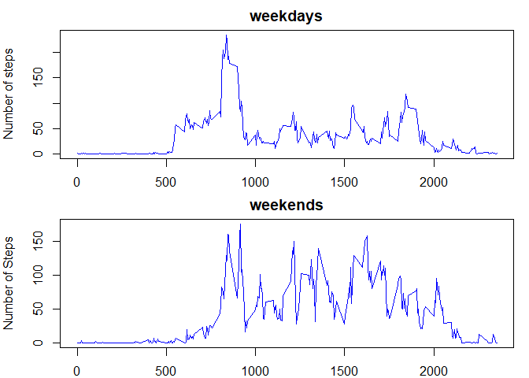

# Activity Monitoring Project
##Loading and preprocessing the data
First data is loaded and date column is changed from character to Date format.

```r
activitydata <- read.csv(file="activity.csv")
activitydata$date <- as.Date(activitydata$date, "%Y-%m-%d")
```

##What is mean total number of steps taken per day?
Total number of steps taken per day is calculated.

```r
dailysteps <- tapply(activitydata$steps, activitydata$date, sum)
```

Here is a histogram of total number of steps taken per day.

```r
hist(dailysteps, main = "Total number of steps taken each day", xlab ="Number of daily steps", col = "Blue")
```

<!-- -->

Mean and median of the total number of steps taken per day is calculated.

```r
dsmean <- mean(dailysteps, na.rm = TRUE)
dsmedian <- median(dailysteps, na.rm = TRUE)
```

Mean is equal to 1.0766189\times 10^{4} and median is equal to10765.

##What is the average daily activity pattern?
The average number of steps taken in each 5 minute interval is calculated.

```r
intervalsteps <- tapply(activitydata$steps, activitydata$interval, mean, na.rm = TRUE)
intervalstepsdf <- data.frame(interval=as.integer(names(intervalsteps)),avg.steps=intervalsteps)
```

Here is a plot of the average number of steps taken in each 5 minute interval, averaged across all days.

```r
plot(intervalstepsdf$interval, intervalstepsdf$avg.steps, type = "l", col= "blue",
     xlab = "interval", ylab = "average number of steps", main = "Average daily activity pattern") 
```

<!-- -->

Maximum number of steps in a 5 minute interval is calculated.

```r
intervalstepsmax <-max(intervalstepsdf$avg.steps)
maxstepsinterval <- intervalstepsdf[intervalstepsdf$avg.steps==intervalstepsmax,]$interval
```

The interval 835 contains the maximum number of steps.

##Imputing missing values

Total number of missing values in the dataset is calculated. 

```r
nacount <- sum(is.na(activitydata))
```

There are 2304 rows with NA values.

Missing values are filled using the mean for that 5 minute interval.

```r
completedata <- merge(activitydata,intervalstepsdf)
na.index <-is.na(completedata$steps)
completedata[na.index,]$steps <- completedata[na.index,]$avg.steps
```

Total number of steps taken each day is calculated using the completed data set.

```r
completedailysteps <- tapply(completedata$steps, completedata$date, sum)
```

Here is a histogram of the total number of steps taken each day.

```r
hist(completedailysteps, main = "Total number of steps taken each day", xlab ="Number of daily steps",col="Blue")
```

<!-- -->

Mean and median total number of steps taken per day is calculated.

```r
completemean <- mean(completedailysteps)
completemedian <- median(completedailysteps)
```

Using the completed dataset, mean is equal to 1.0766189\times 10^{4} and median is equal to1.0766189\times 10^{4}.
Imputing missing values caused an increase in the median of total number of steps taken each day. However the mean is unchanged.

##Are there differences in activity patterns between weekdays and weekends?
A new factor variable is created. This variable has two leels, "weekday" and "weekend".

```r
activitydata$day <- weekdays(activitydata$date)
activitydata$weekday <- as.factor(weekdays(activitydata$date) %in% c("Saturday","Sunday"))
levels(activitydata$weekday) = c("weekday","weekend")
```

Here are the plots that show average number of steps taken over weekdays and weekend.

```r
weekdaysteps <- as.data.frame(tapply(activitydata$steps, list(activitydata$interval, activitydata$weekday), mean, na.rm = TRUE))
weekdaysteps$interval <- row.names(weekdaysteps)
par(mar=c(2,4,2,1),mfrow=c(2,1))
plot(weekdaysteps$interval, weekdaysteps$weekday, type = "l", col= "blue", ylab ="Number of steps", main = "weekdays") 
plot(weekdaysteps$interval, weekdaysteps$weekend, type = "l", col= "blue", ylab ="Number of Steps", main = "weekends") 
```

<!-- -->


  
    


